# Assist Graph and Bounded Loops Plan

**Status:** Approved for planning and documentation only on 2026-08-30. This document does not authorize Phase 2 implementation, production use, or real PHI.

## 1. Outcome

AutoVaxx will use explicit, typed graphs and bounded loops to orchestrate local assistance. Prompts remain versioned instructions inside one extraction node. They do not control workflow, choose clinical outcomes, invoke application tools, or mutate records.

The design deliberately separates three mechanisms:

1. The existing clinical encounter state machine remains the only workflow authority.
2. A proposed assist-session graph coordinates optional speech and field extraction without clinical authority.
3. A synthetic-only evaluation loop measures graph, prompt, schema, model, and decoding changes before they can be considered for implementation.

## 2. Scope gate

The current branch history established Phase 1 foundations. [The Phase 1 implementation contract](PHASE_1_IMPLEMENTATION_CONTRACT.md) does not authorize the documentation vertical slice or local-model integration. **The product owner must explicitly approve Phase 2 before any runtime code, migration, prompt, model adapter, or clinical UI described here is implemented.**

Planning may define interfaces, invariants, fixtures, threat cases, and acceptance gates. It may not claim that the graph exists, works with PHI, is clinically approved, or is production ready.

## 3. Architecture decision record

**Decision status:** Proposed architecture accepted for planning; implementation approval pending

**Date:** 2026-08-30

**Deciders for implementation:** Product owner, engineering owner, and security/privacy owner; the clinical owner must approve any clinical content or scope affected by the implementation.

### Context and constraints

AutoVaxx needs optional local assistance that reduces transcription work without becoming a clinical or workflow authority. It must work offline, preserve manual documentation when providers fail, keep PHI local, minimize retained model artifacts, and fit the existing React-to-Tauri-to-Rust modular monolith. The design must remain understandable and testable without introducing a general agent platform.

### Options considered

#### Option A: Prompt-led single call

| Dimension   | Assessment                                                                                                        |
| ----------- | ----------------------------------------------------------------------------------------------------------------- |
| Complexity  | Low initially; control and recovery behavior becomes implicit as cases grow                                       |
| Safety      | Weak separation between extraction instructions and runtime decisions                                             |
| Testability | Prompt snapshots and end results do not expose each transition or terminal path                                   |
| Fit         | Similar to the placeholder provider port, but insufficient for the documented failure and provenance requirements |

**Pros:** Small initial implementation and no orchestration abstraction.

**Cons:** Retry, validation, cleanup, cancellation, and fallback behavior drift into prompt text or scattered conditionals; safety properties are hard to prove.

#### Option B: Generic graph or agent framework

| Dimension   | Assessment                                                                              |
| ----------- | --------------------------------------------------------------------------------------- |
| Complexity  | High dependency and lifecycle surface for a narrow local flow                           |
| Safety      | Tool, memory, persistence, and routing features enlarge the trusted computing boundary  |
| Testability | Framework behavior can be tested, but version drift and hidden defaults add uncertainty |
| Fit         | Conflicts with the modular-monolith and no-generic-plugin/platform decisions            |

**Pros:** Ready-made graph visualization, persistence, retries, and extensibility.

**Cons:** Solves a much broader problem than AutoVaxx has, adds supply-chain and configuration risk, and encourages tool-using autonomy that the product forbids.

#### Option C: Explicit typed Rust graph with bounded loops

| Dimension   | Assessment                                                                                      |
| ----------- | ----------------------------------------------------------------------------------------------- |
| Complexity  | Moderate and proportional to the small number of known states and edges                         |
| Safety      | Rust owns transitions, budgets, authority checks, validation, and cleanup                       |
| Testability | Every node, edge, loop budget, and terminal outcome is table-testable                           |
| Fit         | Reuses the existing explicit encounter-state pattern without coupling assist and clinical state |

**Pros:** Control flow is inspectable, fail-closed, provider-neutral, and aligned with existing architecture.

**Cons:** Requires deliberate state and error modeling and has less plug-and-play tooling than a framework.

### Decision and trade-offs

Choose Option C for the Phase 2 architecture target. The additional typed states are justified because failures involving PHI cleanup, cancellation, retries, and record mutation must be explicit. Reject Option A because prompt simplicity would hide control behavior rather than eliminate it. Reject Option B because its extensibility is a liability in the current narrow, regulated scope.

This choice makes the runtime less flexible by design: new nodes or loops require code, threat review, fixtures, and release evidence. In return, prompts and providers remain replaceable leaf behavior, manual documentation stays independent, and reviewers can inspect every authority boundary.

### Cancellation ownership decision

Cancellation follows the ownership boundary:

- For a separately provisioned external Ollama service, AutoVaxx enforces its own wall-clock deadline, aborts the in-flight request, quarantines the provider from further use in the current assist session, and returns to manual documentation. It does not terminate a facility-managed service.
- For any future app-owned child process, AutoVaxx places the entire process tree in a Windows Job Object with memory limits and `JOB_OBJECT_LIMIT_KILL_ON_JOB_CLOSE`. A Rust wall-clock timer first requests cooperative cancellation; when the absolute deadline expires, AutoVaxx terminates the job and verifies process exit before cleanup and manual fallback. [Microsoft documents Job Object process-tree termination and resource limits](https://learn.microsoft.com/en-us/windows/win32/procthread/job-objects).

This dual-mode policy preserves process ownership while making the absolute deadline enforceable. Failure to terminate an app-owned child quarantines that provider and prevents an automatic restart during the active patient session.

## 4. Existing mechanisms to reuse

| Existing mechanism                      | Evidence                                | Reuse                                                                                                                                   |
| --------------------------------------- | --------------------------------------- | --------------------------------------------------------------------------------------------------------------------------------------- |
| Explicit workflow edges                 | `src-tauri/src/domain/encounter.rs`     | Use the same typed-state and explicit-transition style for assist-session control flow. Do not merge assist state into encounter state. |
| Authorization and recent authentication | `src-tauri/src/application/services.rs` | Every accepted proposal becomes an ordinary authorized draft edit. AI never bypasses application services.                              |
| Expected revisions and atomic audit     | `src-tauri/src/adapters/sqlite/mod.rs`  | Accepted fields use the established expected-revision and mutation-plus-audit transaction pattern.                                      |
| Narrow provider boundary                | `src-tauri/src/ports/providers.rs`      | Extend from real use cases with typed requests, responses, provenance, deadlines, cancellation, and errors.                             |
| Fail-closed optional providers          | `src-tauri/src/adapters/providers.rs`   | Provider failure exits to manual documentation without changing clinical state.                                                         |

There is no current prompt pipeline, orchestration engine, retry utility, extraction evaluation suite, Ollama adapter, or application call site for `LocalAiProvider`. This plan adds no generic graph framework or orchestration dependency.

## 5. Runtime assist-session graph

Sources: [Mermaid](../diagrams/assist-session-graph.mmd) · [editable Excalidraw](../diagrams/assist-session-graph.excalidraw) · [PNG](../diagrams/assist-session-graph.png)

### 5.1 State ownership

The Rust application layer owns graph position, transition policy, budgets, cancellation, and terminal cleanup. Provider adapters receive one bounded request and return one untrusted result or typed error. The model cannot see the graph definition or request a transition.

Assist-session state is transient and separate from `EncounterState`. An assist terminal state cannot imply `READY_TO_ADMINISTER`, `FINALIZED`, `REGISTRY_READY`, or any other clinical workflow state.

### 5.2 Proposed node contract

| Node                           | Responsibility                                                                                                                                                                      | Permitted output                                       | Must not do                                                                                                                                      |
| ------------------------------ | ----------------------------------------------------------------------------------------------------------------------------------------------------------------------------------- | ------------------------------------------------------ | ------------------------------------------------------------------------------------------------------------------------------------------------ |
| Capture                        | Accept bounded typed text or private local audio                                                                                                                                    | Ephemeral source handle and source type                | Persist source, place content in logs, or accept arbitrary files                                                                                 |
| Transcribe                     | Convert validated local audio to transient text                                                                                                                                     | Transcript plus non-content provenance                 | Use cloud speech, retain audio, treat transcript as fact, or exceed the cancellation policy for its process-ownership mode                       |
| Extract                        | Verify the approved model identity, then ask a local provider for schema-constrained field proposals                                                                                | Untrusted proposal envelope plus provider/model digest | Write records, call tools, choose workflow edges, infer unsupported clinical conclusions, or use an unapproved model digest                      |
| Envelope validation            | Enforce size, encoding, schema, allowed fields, cardinality, and provenance                                                                                                         | Typed candidate or structured rejection                | Repair clinical meaning or silently discard invalid fields                                                                                       |
| Deterministic field validation | Apply code-set, type, range, source-span, and documentation-scope checks                                                                                                            | Field-level results with rule versions                 | Interpret eligibility, contraindications, precautions, recommendations, or forecasting                                                           |
| Human review                   | Display source and proposal distinctions and collect accept/reject/correct/cancel decisions                                                                                         | Explicit reviewer disposition                          | Preselect risky fields, hide uncertainty, or auto-accept                                                                                         |
| Apply draft edit               | Re-authenticate as required, check expected revision, and commit accepted fields plus audit                                                                                         | New ordinary draft revision                            | Change encounter state, confirm administration, finalize, export, or transmit                                                                    |
| Cleanup                        | Cryptographically erase and delete any encrypted temporary artifact; discard in-memory audio, transcript, prompt context, response, rejected proposals, spans, and per-session keys | Minimum non-content cleanup result                     | Write plaintext assist artifacts to disk, claim SSD overwrite guarantees, or copy patient content into operational diagnostics/support artifacts |

### 5.3 Terminal paths

Every run ends in exactly one explicit outcome:

- **`APPLIED`:** The reviewer accepted selected fields and they were written to an ordinary draft revision.
- **`REJECTED`:** The reviewer explicitly discarded the proposals without changing the draft.
- **`CANCELLED`:** The user or system interrupted assistance and cleanup completed without changing the draft.
- **`MANUAL_FALLBACK`:** Assistance failed safely and released control to ordinary manual documentation.
- **`POLICY_DENIED`:** Authorization, locality, model identity, capability, or another guardrail blocked the request before mutation.

Timeout, provider unavailability, resource exhaustion, malformed output, session lock, logout, process restart, and cleanup failure must be modeled and tested rather than allowed to fall through.

`APPLIED` means selected fields were written to a draft. It does not mean the encounter is complete, safe, eligible, ready to administer, finalized, registry ready, transmitted, or accepted by PREIS.

## 6. Bounded loop policy

| Loop                                            |                                                                Maximum | Entry condition                                                                                                              | Exit and safety behavior                                                                                                                                |
| ----------------------------------------------- | ---------------------------------------------------------------------: | ---------------------------------------------------------------------------------------------------------------------------- | ------------------------------------------------------------------------------------------------------------------------------------------------------- |
| Transient provider retry                        |                                    One retry after the initial attempt | Typed transient transport/unavailable error and remaining absolute deadline                                                  | Exit to manual fallback; never retry policy denial, cancellation, `OUT_OF_MEMORY`, provider `DISK_FULL`, another resource limit, or semantic invalidity |
| Structural repair                               |                                                     One repair request | Envelope is syntactically/schema malformed, repair capability is supported, and source remains in the same ephemeral session | Revalidate from zero; exit to manual fallback if still invalid                                                                                          |
| Human correction and deterministic reevaluation | User-driven, one new immutable draft revision per submitted correction | Reviewer changes ordinary draft data                                                                                         | Re-run versioned deterministic rules on the new revision; AI cannot resolve or suppress findings                                                        |
| Development evaluation                          |                          Until the candidate passes all required gates | A controlled graph, prompt, schema, model, or decoding change                                                                | Never iterate on patient data; change one controlled variable per run and retain before/after evidence                                                  |

All provider work shares one cancellation token, one absolute deadline, and explicit input/output size limits. Retrying never extends the deadline. Exact time and size budgets must be calibrated on representative Windows 11 hardware before Phase 2 acceptance; they are configuration policy, not prompt text.

Provider-side `OUT_OF_MEMORY` and `DISK_FULL` errors bypass transient retry and structural repair because another inference attempt can worsen resource pressure. They quarantine assistance for the active session and route directly to `MANUAL_FALLBACK`. `DISK_FULL` is classified as provider-side only when the failing path is isolated and clinical persistence health is confirmed; an unknown or shared-volume exhaustion is treated as `PERSISTENCE_FULL`. A full clinical datastore is a blocking integrity failure, no clinical mutation is reported as successful, and manual entry inside AutoVaxx remains blocked until safe persistence is restored.

## 7. Prompt boundary

Prompts are versioned extraction templates selected by deterministic code using an approved purpose, locale, schema version, and supported field allowlist. A prompt may explain the requested JSON shape and require uncertainty/source spans. It may not contain workflow transitions, authorization policy, clinical clearance logic, registry authorization, tool instructions, hidden fallback behavior, or patient-specific durable memory.

Persist the template identifier/version and cryptographic hash, not the rendered prompt. The audit/provenance record for an applied proposal includes that exact hash so reviewers can identify the instructions that were active without retaining patient-bearing rendered content. Any prompt, model, decoding, schema, or graph change requires a before/after evaluation run. A higher model-quality score cannot replace deterministic rule tests or human review.

## 8. Minimum provider contract for Phase 2 design review

The current `LocalAiProvider::propose_fields(&str)` placeholder is intentionally insufficient for implementation. The Phase 2 contract should be designed from the graph and include:

- health/readiness and schema-constrained-output capability;
- provider, endpoint, approved model digest, template hash, schema, and decoding provenance;
- bounded input and output types with an allowed field set;
- source spans and uncertainty indicators;
- absolute deadline and cooperative cancellation;
- typed `UNAVAILABLE`, `TIMEOUT`, `HARD_TERMINATED`, `PROCESS_TERMINATION_FAILED`, `MALFORMED_OUTPUT`, `UNSUPPORTED_CAPABILITY`, `OUT_OF_MEMORY`, provider-runtime `DISK_FULL`, `RESOURCE_LIMIT`, `MODEL_DIGEST_MISMATCH`, `POLICY_DENIED`, and `CANCELLED` errors;
- loopback identity validation on every patient-bearing request, with redirects and proxies rejected;
- no domain repositories, application commands, filesystem tools, registry clients, credentials, or arbitrary network access.

The approved evaluation manifest pins the provider version, model name, and content digest. At provider readiness and before the first patient-bearing assist session, the adapter compares the runtime-reported digest with the approved digest and fails with `MODEL_DIGEST_MISMATCH` if they differ. Ollama exposes a model digest through its local model-listing API; AutoVaxx uses the digest rather than scanning an externally managed multi-gigabyte blob store. [Ollama model-listing API](https://docs.ollama.com/api/tags)

If a future app-owned runtime packages model files directly, provisioning verifies the full artifact checksum/signature and startup re-verifies it under the approved supply-chain policy. Cached verification is acceptable only when bound to immutable artifact identity and invalidated by any metadata or content change.

## 9. Data retention and audit

During human review, ephemeral memory may hold the minimum source, provider response, proposals, spans, and uncertainty needed for verification. Audio and text use bounded RAM or anonymous pipes whenever the provider contract permits. On accept, reject, cancel, timeout, logout, session lock, or recovery cleanup, discard patient-bearing memory and delete assist artifacts under the approved recovery policy.

Plaintext assist content must not be written to disk. If a provider makes a temporary file unavoidable, AutoVaxx writes only ciphertext to an application-private path using a fresh per-session data key held outside the file, restrictive Windows ACLs, a random nonidentifying filename, and no path in logs or process arguments. Cleanup sanitizes the per-session key, closes handles, and deletes the ciphertext; startup recovery removes validated AutoVaxx-owned orphaned ciphertext without opening patient content.

AutoVaxx does not claim that overwriting a file securely sanitizes an SSD. NIST guidance notes that ordinary overwrite methods may miss flash locations because of wear leveling and overprovisioning, while current guidance recognizes cryptographic erase as a sanitization technique. [NIST media-sanitization bulletin](https://csrc.nist.gov/csrc/media/publications/shared/documents/itl-bulletin/itlbul2015-02.pdf) · [NIST SP 800-88 Rev. 2](https://csrc.nist.gov/pubs/sp/800/88/r2/final)

Before real PHI, Windows deployment evidence must also address BitLocker/device encryption, pagefile and hibernation behavior, crash-dump policy, endpoint-security collection, and whether the chosen child process can keep patient-bearing input out of temporary files.

Persist only the minimum fields already anticipated by [the data model](DATA_MODEL.md): assist-session identity and purpose, provider version, approved model digest, prompt-template identifier/version/hash, schema and decoding versions, timestamps, validation outcome, target field names, reviewer disposition, cleanup disposition, and the resulting ordinary revision reference. Accepted values live only in the clinical draft revision. Rejected values and raw prompts/responses are not retained by default.

Operational logs may record duration, attempt count, terminal outcome, and non-sensitive error class. They must not contain source text, transcript, proposed values, spans, identifiers, filenames, prompt content, or model response content.

## 10. Synthetic evaluation loop

Sources: [Mermaid](../diagrams/assist-evaluation-loop.mmd) · [editable Excalidraw](../diagrams/assist-evaluation-loop.excalidraw) · [PNG](../diagrams/assist-evaluation-loop.png)

The corpus uses clearly fictional English and Spanish cases, reserved/example identifiers, missing/unknown values, ambiguous text, malicious prompt-like input, oversized input, malformed provider output, unsupported fields, cancellation, timeouts, and provider unavailability.

Each run records at least:

- field exactness and omission by field and language;
- unsupported-field proposal rate;
- valid source-span rate;
- raw envelope/schema validity;
- deterministic-validation pass and rejection reasons;
- human fallback and correction rate in workflow tests;
- accepted-as-is rate, accepted-with-correction rate, and correction actions per accepted proposal;
- time-to-fallback from failure detection until the manual form is usable, reported at median and 95th percentile;
- median and 95th-percentile latency on representative hardware;
- zero unauthorized mutations, workflow transitions, exports, transmissions, and non-loopback requests;
- zero synthetic PHI-like sentinels in logs, crash output, temp remnants, support bundles, and process arguments.

Safety gates are absolute. A candidate with an authority, locality, retention, audit, or cleanup violation cannot trade that failure for better extraction accuracy.

Correction and fallback metrics measure utility without creating patient-bearing telemetry. They come from the synthetic evaluation suite and approved usability studies by default. Any later operational metric must be explicitly approved, contain only non-PHI counters/timings, avoid patient/user identifiers and field values, and never become hidden surveillance.

## 11. Phase 2 implementation sequence, not yet authorized

1. Confirm Phase 1 exit evidence and obtain explicit product-owner authorization for Phase 2.
2. Approve the assist data flow and threat-model delta, including crash cleanup and provider process boundaries.
3. Create the synthetic evaluation corpus and baseline the unavailable fake before changing prompts or models.
4. Define typed assist states, transitions, terminal outcomes, dual-mode cancellation, loop budgets, request/response envelopes, model-digest policy, and provider/persistence error separation in Rust.
5. Implement a fake provider and table-driven graph tests before the Ollama adapter.
6. Add the application service and narrow Tauri commands; prove authorization bypasses and direct state changes fail.
7. Add RAM/pipe-first handling, encrypted temporary-artifact cleanup, and minimal provenance migrations; verify the real encrypted SQLite path, audit atomicity, restart, and restore behavior.
8. Implement the loopback-only Ollama adapter with digest pinning and external-service abort/quarantine, then the human-review UI and manual fallback. Any app-owned runtime remains a separate packaging decision and must use a tested Windows Job Object termination path.
9. Run the full synthetic eval and offline/security workflow, repair failures, and record before/after evidence.
10. Update requirements, architecture, data model, security, roadmap, migrations, and acceptance evidence together before requesting Phase 2 exit review.

## 12. Explicitly not in scope

- Generic graph, agent, plugin, rules-DSL, broker, background-job, or microservice frameworks.
- Autonomous clinical interpretation, recommendation, forecasting, contraindication/precaution evaluation, or eligibility clearance.
- AI-driven workflow changes, administration confirmation, finalization, correction/void, export authorization, PREIS mapping decisions, transmission, or acknowledgement handling.
- Cloud AI/speech, remote provider endpoints, cloud fallback, app-managed model downloads, or patient-bearing telemetry.
- Raw prompt/response/audio retention, patient-specific memory, self-improving production loops, or training on patient encounters.
- Production or real-PHI use before the separate clinical, privacy, security, operational, encryption, backup/restore, and Windows acceptance gates pass.

## 13. Definition of done for later implementation

- Every graph state and edge is explicit, typed, authorized where applicable, and covered by table-driven tests.
- Every loop has a fixed attempt budget, absolute deadline, cancellation path, and tested terminal fallback.
- External-provider abort/quarantine and app-owned process-tree termination are separately tested; a child process that ignores cooperative cancellation cannot survive the hard deadline unnoticed.
- Provider `OUT_OF_MEMORY`/`DISK_FULL` bypass retry and repair, while clinical `PERSISTENCE_FULL` blocks mutation and cannot be reported as successful fallback.
- The runtime model digest, prompt-template hash, schema version, and decoding version match the approved evaluation manifest and applied-proposal provenance.
- Every accepted proposal uses expected revision and one atomic draft-revision-plus-audit transaction.
- Provider/model/prompt failure never blocks deterministic manual documentation or changes clinical state.
- Restart, lock, logout, timeout, cancellation, disk-full, malformed-output, unavailable-provider, and cleanup paths are exercised on the real application path.
- The approved synthetic evaluation suite shows before/after results with no safety-gate violation or unexplained required-metric regression.
- Time-to-fallback and correction-friction targets are approved from synthetic/usability baselines and pass at the required median and 95th percentiles.
- No PHI or synthetic PHI-like sentinel appears in prohibited outputs, and no patient-bearing request reaches a non-loopback destination.
- The product continues to state explicitly that AutoVaxx does not evaluate clinical eligibility.
